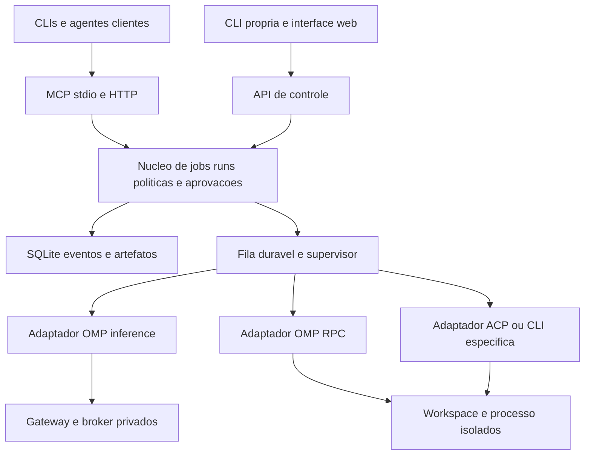

# Auditoria integral — OMP Orchestrator

Data: 25/09/2026, America/Sao_Paulo. Coleta também identificada em UTC nos anexos.

## Parecer

**O projeto tem uma base aproveitável de orquestração de inferências, mas ainda não oferece uma plataforma independente de agentes nem uma aplicação pronta para VPS. Recomendo evolução incremental, começando pela correção das garantias de execução e pela separação entre núcleo, interfaces de entrada e motores de execução.**

O investimento existente em SQLite, histórico de consumo, contratos, artefatos e revisão deve ser preservado. A suíte passa, mas reproduções adicionais encontraram defeitos de protocolo, concorrência, recuperação e limites de execução. Empacotar o estado atual em Docker não resolveria esses problemas.

O objetivo confirmado pelo usuário tem dois sentidos: qualquer cliente/CLI/agente deve poder **controlar** o Orchestrator; agentes diferentes também devem poder ser **executados por** ele. Essas duas interfaces precisam ser independentes. O OMP continua sendo uma integração principal, sem ser requisito de todos os futuros motores.

O perfil VPS ainda não foi respondido durante esta coleta. A proposta usa como primeira entrega uma instalação de uma pessoa/equipe confiável, com API, CLI e interface web mínima. Uma plataforma com clientes mutuamente isolados é apresentada como escopo adicional, sem pressupor autorização para implementá-la.

## Base e método

| Item | Evidência |
|---|---|
| Repositório | [garciarsdiego/omp-orchestrator](https://github.com/garciarsdiego/omp-orchestrator) |
| Commit auditado | [`1f304720fce254e2bee0901dfcb96b16028b018a`](https://github.com/garciarsdiego/omp-orchestrator/tree/1f304720fce254e2bee0901dfcb96b16028b018a) |
| Branch/base | `main`, último commit de 28/07/2026; nenhuma alteração de produto nesta auditoria |
| Versões declaradas | Pacote e servidor MCP `0.7.0`; manifesto do plugin `0.4.0` |
| Dimensão | 48 arquivos rastreados; 19 módulos em `mcp/`, 3.097 linhas; 28 ferramentas MCP; 11 arquivos de testes |
| Ambiente verificado | Windows, Node `v24.17.0`, OMP instalado `18.3.0` |
| Upstream consultado | OMP `v18.3.2`, commit `7853b4e499936f9dcc13c9b64adb55f6b342aabf`; tag e `main` coincidiam na coleta |
| Release upstream | Publicada em 26/09/2026 00:00:25 UTC, equivalente a 25/09/2026 21:00:25 no fuso local |
| GitHub do projeto | API retornou zero releases e zero workflows; `git ls-remote --tags origin` não retornou tags |

A pasta inicialmente continha apenas um Git sem commits. O `origin/main` público foi obtido nela para tornar a auditoria reproduzível. Instalação das dependências pelo lockfile, testes, probes sintéticos e documentos são as únicas adições locais. Não houve push, deploy, atualização do OMP, alteração de configuração/credencial ou inferência de provedor.

Inspeção dividida em interfaces/distribuição, segurança/execução/persistência e contratos recentes do upstream. O histórico antigo 0.4 foi usado apenas para orientação: SQLite e governança de jobs já existem em 0.7 e não devem ser apresentados como trabalho ainda inteiramente por fazer.

## Estado funcional real

| Área | Implementado | Limite observado |
|---|---|---|
| Descoberta OMP | Executável, versão, config, roles, catálogo por CLI | Sem matriz de versões/capabilities; chamadas síncronas bloqueiam o servidor |
| Providers | Mapeamento de dez famílias e seleção explícita de modelo | Readiness infere presença no catálogo; não prova credencial válida nem capacidade operacional |
| Transporte | MCP stdio manual, 28 ferramentas | Sem CLI própria, HTTP público, SDK/documentação de API ou suporte completo ao MCP recente |
| Inferência | Responses não streaming via gateway autenticado | Não é uma sessão de agente que edita arquivos, executa ferramentas e pode ser dirigida ao longo do trabalho |
| Jobs | Persistência, tentativas, contratos, estimativa, consumo e cancelamento | Concorrência, cobrança sob falhas e transições exigem correções |
| Runs | Três templates, checkpoints, eventos, artefatos e atestação | Fluxos especializados; não há executor genérico de DAGs definidos pelo usuário |
| Artefatos | Objetos por SHA-256, referências e GC | Hash e contrato não provam qualidade, segurança do HTML ou autoria do revisor |
| Persistência | SQLite/WAL, migrations, importação explícita de JSON | Transações existentes não protegem todas as operações de leitura-modificação-gravação |
| Custos | Registry versionado, `observe/enforce/disabled`, desconhecido preservado | Poucas entradas, procedência `operator-reviewed`; não equivale a fatura nem a cobertura universal |
| Revisão | `accept/revise/reject`, estado `awaiting_codex` | Acoplamento ao nome Codex; não há identidade autenticada do revisor |
| Segurança local | Loopback, bearer interno, confirmações, scanner de alguns padrões | Contexto de confiança é o usuário local; faltam fronteiras de acesso remoto e isolamento de agentes |
| Entrega | Plugin Codex e execução via Node | Sem aplicativo web, imagem/container do projeto, serviço gerenciado ou release automatizada |

Os templates são `multi-model-build-review`, `single-file-web-app` e `independent-analysis`; os dois primeiros compartilham os mesmos nós. `run-worker.mjs:163–266` implementa procedimentos concretos e um desvio por nome de template. A presença de `dependsOn` nos dados não constitui um scheduler genérico.

## Verificação executada

| Verificação | Resultado | O que permite concluir |
|---|---|---|
| `npm ci --no-audit --no-fund` | Passou, 38 pacotes instalados | O lockfile instala neste Windows/Node; não prova portabilidade Linux |
| `npm test` | **46/46 passaram**, zero skips | Suíte existente está verde; defeitos adicionais abaixo não eram cobertos |
| `npm audit --json` | **Zero vulnerabilidades conhecidas** | Resultado do registry na coleta; não é auditoria de segurança do produto |
| `npm run smoke` | **Falhou: `OMP doctor failed`** | O ambiente local não atende ao critério atual do doctor |
| `doctor()` detalhado | 16 roles, 1.498 modelos; cinco roles não resolvidas | CLI de versão/config/catálogo funcionou com OMP 18.3.0 |
| MCP e contratos sintéticos | Falhas reproduzidas, ver anexo | Provas locais sem quota, runtime real ou credenciais |
| Concorrência/recuperação | Reproduções sintéticas no anexo de runtime | SQLite íntegro não implica estado da aplicação correto |
| `npm pack --dry-run --json` | Tarball calculável; manifesto incluído | Não existe ainda pacote publicável/executável autônomo: `private:true`, sem `bin`/`exports` |
| Linux, Docker, VPS, inferência real | **Não executados** | Nenhuma alegação de funcionamento de produção ou integração paga ponta a ponta |

Roles não resolvidas no ambiente local: `task`, `web`, `image`, `speech`, `default`. Os seletores estão em `doctor-local.json`. Isso pode combinar configuração local antiga, modelo customizado e modalidades diferentes; a auditoria **não atribui automaticamente essas cinco divergências a uma quebra do OMP 18**. O doctor precisa reportar capacidade por finalidade e verificar apenas as dependências do fluxo escolhido.

O dry-run do pacote incluiu documentos produzidos pela própria auditoria, por não haver lista `files` de distribuição. Isso demonstra ausência de delimitação do pacote; não prova que esses documentos tenham sido publicados.

## Achados de interfaces, contratos e distribuição

Severidade: **P1** = corrigir antes de ampliar execução/usuários; **P2** = defeito ou limitação relevante; **GAP** = capacidade nova solicitada, não regressão do escopo original. Não há evidência para declarar um incidente de segurança ou uma exposição pública já existente.

### I00 — P1: escolha explícita de provider é perdida antes da inferência

`mcp/jobs.mjs:94–102` persiste provider/model, mas `mcp/job-worker.mjs:24–34` envia apenas `job.request.model`; `mcp/gateway.mjs:104–132` o coloca no campo `model` do body. Dois providers com o mesmo ID de modelo tornam essa seleção ambígua.

No OMP 18.3.2, [`auth-gateway-cli.ts:194–210`](https://github.com/can1357/oh-my-pi/blob/7853b4e499936f9dcc13c9b64adb55f6b342aabf/packages/coding-agent/src/cli/auth-gateway-cli.ts#L194) registra sempre `provider/id`; o ID simples é um fallback em que vence o primeiro provider registrado. O [handler do gateway](https://github.com/can1357/oh-my-pi/blob/7853b4e499936f9dcc13c9b64adb55f6b342aabf/packages/ai/src/auth-gateway/server.ts#L270) resolve o body e utiliza o provider resultante para credenciais e contabilização. A análise do caminho de código confirma a ambiguidade; nenhuma chamada real foi feita para medir o efeito em uma conta.

**Impacto:** provedor, quota e preço usados podem divergir do selector aprovado e da proveniência local. **Correção:** preservar o identificador composto `provider/model` no campo `model` aceito pelo upstream, separando o esforço. Gate: fixture com o mesmo model ID em dois providers envia a rota explicitamente aprovada e registra a identidade efetivamente resolvida. Detalhes e fontes em `omp-upstream.md`.

### I01 — P1: schemas MCP não são aplicados; confirmações aceitam valores truthy

`mcp/server.mjs:289–339,370–386` encaminha `arguments` diretamente às funções. `additionalProperties:false`, tipos e limites dos schemas não são validados. `mcp/jobs.mjs:59` usa `if (!confirmQuota)`, de modo que a string `"false"` passa pelo bloqueio de confirmação. A prova enviou deliberadamente um pedido incompleto, parando na validação seguinte sem consumir quota. Argumento não declarado também foi aceito por `omp_routing_policy`.

**Impacto:** clientes com comportamento diferente podem enviar opções internas como `jobRoot`/`rolesOverride`, valores de tipo errado ou confirmações ambíguas. As flags atuais não equivalem a autorização autenticada para acesso remoto.

**Correção:** validar envelope e schema antes do despacho; exigir `=== true`; separar opções internas de DTOs públicos; associar aprovações futuras a ator, escopo, orçamento e hash do pedido. Gate: argumentos inválidos não chegam ao domínio e não criam processos/estado.

### I02 — P1 para a meta de interoperabilidade: servidor MCP anuncia contratos que não cumpre

`mcp/server.mjs:362–375` ecoa qualquer `protocolVersion` recebido. A prova negociou `1900-01-01` com sucesso. `omp_pipeline_templates` retorna array em `structuredContent`; o contrato legado 2025-06-18 exige objeto, portanto clientes estritos podem rejeitar a resposta. Listagens de jobs/runs usam o mesmo padrão.

A [especificação atual consultada, 2026-07-28](https://modelcontextprotocol.io/specification/2026-07-28/basic/versioning), usa versão/capabilities por requisição e define `server/discover`; o projeto retorna `Method not found` para esse método. Suporte legado explícito continua válido, mas não autoriza anunciar uma versão moderna por eco. A [especificação de ferramentas 2025-06-18](https://modelcontextprotocol.io/specification/2025-06-18/server/tools) é a referência para o objeto `structuredContent`.

**Correção:** transporte MCP apoiado em implementação mantida que suporte as revisões escolhidas; suporte legado/moderno testado e explícito; envelopes como `{items:[...]}` e schemas de saída. Gate: testes com cliente estrito, versões suportadas/não suportadas e erro previsível em capacidades ausentes.

### I03 — P2: JSON válido `null` derruba o servidor MCP

`mcp/server.mjs:353–389` parseia JSON sem validar se é um objeto de requisição. O `catch` acessa novamente `request.method` quando `request` é `null`. Prova: processo encerrou com código 1 e `TypeError` após receber `null`.

**Correção:** validar envelope antes de acessar propriedades, emitir `Invalid Request` e manter o serviço vivo. Testar valores primitivos, arrays, parâmetros inválidos e mensagens grandes. Não acrescentar protocolo HTTP sobre esse parser sem corrigir isso.

### I04 — P2: a quarentena de modelo é burlada pelo sufixo de esforço

`mcp/run-manager.mjs:18–23` compara selector literal. `xai-oauth/grok-composer-2.5-fast` é bloqueado para HTML, mas o mesmo selector com `:high` recebe `allowed:true` na prova. A normalização já existente em `pricing.mjs` não é aplicada aqui.

**Correção:** identidade canônica provider/model separada de opções de execução; aplicar regras ao identificador canônico. Gate: todos os esforços preservam a decisão da regra.

### I05 — P2: contrato de HTML offline aceita dependência externa e rejeita documento estático válido

`mcp/gateway.mjs:52–59` procura apenas `http://`/`https://`. `mcp/validators.mjs:9–21` exige script e faz checagem de sintaxe, sem verificar recursos carregados pelo DOM.

Provas: HTML com `<script src="//example.invalid/app.js">` passou; relatório HTML estático sem JavaScript falhou. Marcadores de acessibilidade e `node --check` não demonstram funcionamento, acessibilidade ou ausência de rede no navegador.

**Correção:** separar contrato HTML geral de requisitos de aplicação interativa; analisar referências de recursos; validar comportamento em navegador quando necessário. Na futura UI, renderizar artefatos em contexto isolado com políticas próprias: nunca executar HTML gerado com a autoridade da aplicação de controle.

### I06 — P2: readiness e diagnóstico confundem catálogo com capacidade operacional

`mcp/providers.mjs:65–103` calcula `ready` a partir da existência de modelos, sem testar expiração, rate limit ou alcance do endpoint. `mcp/lib.mjs:73–92` transforma qualquer role não encontrada no catálogo em falha global. Os dez providers são uma seleção histórica fixa; outros ainda podem ser usados por selector, mas não aparecem nesse relatório.

**Correção:** distinguir `catalogued`, autenticação observável, capacidade suportada e saúde recente; registrar origem/timestamp/TTL e estado desconhecido. Inferência faturável de teste deve ser explícita. Doctor por fluxo deve separar roles textuais de imagem/áudio e modelos customizados.

### I07 — P2: distribuição e documentação não representam a versão real

- `.codex-plugin/plugin.json:3` está em 0.4.0; `package.json:3` e servidor em 0.7.0.
- README ainda diz servidor sem dependências e jobs somente no temporário, embora exista `better-sqlite3` e SQLite durável em seções posteriores.
- `NEXT_STEPS.md` termina mandando executar a Fase 0 depois de registrar as Fases 1 e 2 como concluídas; decisões antigas de manter Codex obrigatório e não ter dashboard precisam ser revistas para o pedido atual.
- `.mcp.json` usa `./mcp/server.mjs` e `cwd:"."`; clientes interpretam diretório/base de formas diferentes. Não há instalador que gere caminhos absolutos nem comando binário estável.
- `package.json` declara Node `>=20`; o `better-sqlite3` fixado no lockfile é 12.4.1 e declara `20.x || 22.x || 23.x || 24.x`. A promessa do pacote é mais ampla que a dependência efetivamente testada.
- Sem CI, releases/tags, matriz Linux/Windows, `bin`, `exports`, lista `files` ou smoke a partir de diretório externo.

**Correção:** fonte única de versão; instalação e invocação independentes do cwd; suportes de runtime explicitamente testados; documentação reescrita para o estado final; CI e pacote inspecionado antes de release.

## Execução, orçamento e persistência

| ID | Prioridade | Achado e evidência | Local principal |
|---|---|---|---|
| RT-01 | P1 | Budget da run não é repassado aos jobs nem comparado ao uso real agregado. Nós paralelos verificam o mesmo saldo, sem reserva. Evidência de código; sem gasto real | `run-worker.mjs:33–123` |
| RT-02 | P1 | Dois processos fizeram 1.000 incrementos na mesma run; o resultado foi **523**, ambos com sucesso e SQLite íntegro. Leitura fora da transação permite sobrescrita | `run-store.mjs:49–111`, `job-store.mjs:33–79` |
| RT-03 | P1 | Recovery manteve job com PID vivo em `running`, interrompeu a run e o preparo de resume apagou seu `jobId`; caminho permite duplicar trabalho | `recovery.mjs:13–56`, `run-manager.mjs:193–205` |
| RT-04 | P1 | Saldo zero de retry virou novos defaults de 128.000/192.000 tokens. `enforce` com `usage=null` calculou zero, sem violação | `jobs.mjs:141–169`, `budget.mjs:9–120` |
| RT-05 | P1 | Segredo sintético reconhecível pelo scanner persistiu em `run.input`; a proteção de jobs/artefatos não cobre toda a fronteira de gravação | `run-manager.mjs:120–166`, `run-store.mjs:49–68` |
| RT-06 | P1 | Primeira inicialização com oito processos apresentou falha em **11 de 20 ensaios**, incluindo tabelas já existentes; migrations usam snapshot anterior ao lock | `storage.mjs:27–219` |
| RT-07 | P1 | Cancelamento confirmado mudou uma run já aceita de `succeeded` para `cancelled`, invalidando acesso normal ao resultado | `run-manager.mjs:278–292` |
| RT-08 | P2 | Resultado terminal, consumo e eventos de política são commits separados; crash entre eles deixa ledger incompleto. Evidência de código | `job-worker.mjs:44–62` |
| RT-09 | P2 | Reaplicar migração com eventos falhou por chave única e timestamps históricos foram substituídos pelo horário da importação | `migration.mjs:37–88` |
| RT-10 | P2 | PID existente + porta TCP aberta não provam identidade do processo; stop pode sinalizar PID reutilizado. Risco derivado do código, sem teste destrutivo | `runtime.mjs:13–99,141–150` |

Os achados detalhados, correções e reproduções desta frente estão em [runtime-findings.md](runtime-findings.md), com script [runtime-probes.mjs](runtime-probes.mjs). Eles têm prioridade anterior à ampliação para agentes ou rede. A auditoria consolidou **18 achados: 10 P1 e 8 P2**, além dos requisitos novos de arquitetura. A classificação P1 é de prioridade de correção para o objetivo solicitado, não de incidente confirmado.

Como critério econômico e técnico, os limites devem expressar o que realmente conseguem garantir: número de dispatches pode ser reservado antes da chamada; tokens são limitados pelo motor e reconciliados depois; custo de respostas parciais/canceladas pode permanecer desconhecido. Um processo encerrado não prova estorno nem ausência de consumo no provedor.

## OMP atual: recursos a incorporar

A [release 18.3.2](https://github.com/can1357/oh-my-pi/releases/tag/v18.3.2) é a referência fixa desta análise. Sua compatibilidade de execução ainda não foi testada neste projeto; o smoke local usou 18.3.0. Fontes de código e matriz completa: [omp-upstream.md](omp-upstream.md).

| Recurso verificado no upstream | Decisão proposta |
|---|---|
| CLI pública de modelos/configuração | Manter atrás de um adaptador com validação de formato, cache limitado e capability probe |
| Gateway com vários protocolos/modalidades e operação remota | Preservar Responses para inferência; tornar endpoint/ownership configuráveis; não publicar a vault/broker diretamente |
| RPC JSONL com `prompt`, `steer`, `abort`, sessões e eventos | Primeiro motor de agente: `omp-rpc`, separado de `omp-inference` |
| `prompt_result` e `session_settled` | Distinguir término de um turno de quiescência da sessão; não marcar job concluído no primeiro evento conveniente |
| ACP sobre stdio | Adaptador reutilizável quando atender a uma CLI alvo; não é substituto automático de MCP |
| Agent Hub/subagentes, identidades e worktrees | Incorporar após o ciclo básico do agente, com relação pai/filho, budgets agregados e ownership de workspace |
| MCP no runtime OMP | O OMP consome ferramentas; o Orchestrator expõe ferramentas. Separar os dois papéis para evitar ciclos e ampliação implícita de permissões |
| Docker, robomp, collab-web | Avaliar componentes que reduzam trabalho; não confundir essas superfícies upstream com a aplicação stand-alone deste projeto |

Não há razão para copiar todos os recursos do OMP. LSP, ferramentas internas de edição, compaction e catálogo detalhado devem continuar pertencendo ao runtime quando o adaptador puder delegar a ele. O Orchestrator deve concentrar políticas, filas, aprovações, artefatos, rastreabilidade e integração entre motores.

## Arquitetura proposta

Proposta de módulos dentro de um único projeto/processo de controle inicial; não requer microserviços.

### Entrada: diferentes clientes controlando o mesmo núcleo

Extrair o domínio de `mcp/` para um núcleo que não importe o transporte. MCP, CLI e API chamam as mesmas operações e políticas. Expor contratos versionados para estimar, criar, observar eventos, cancelar, retomar, aprovar e obter artefatos. Acrescentar idempotency key para criação e paginação/cursor estável para eventos e listagens.

MCP stdio atende clientes locais. HTTP autenticado atende integração remota; a [especificação de transporte](https://modelcontextprotocol.io/specification/2026-07-28/basic/transports/streamable-http) exige, entre outros pontos, tratamento de `Origin`. Para interoperabilidade MCP remota ampla, adotar a [autorização especificada](https://modelcontextprotocol.io/specification/2026-07-28/basic/authorization), em vez de presumir que o bearer interno do gateway seja credencial de usuários do produto.

Um comando próprio, por exemplo `omp-orchestrator serve`, `doctor`, `run`, `events` e `cancel`, é interface proposta, ainda inexistente. A flag `--json` deve entregar contratos estáveis, e erros devem produzir exit code apropriado. Isso permite integração mesmo com clientes sem MCP.

### Saída: diferentes motores executando trabalho

Definir `ExecutionBackend` com operações equivalentes a `capabilities`, `start`, `events`, `cancel`, `inspect` e, quando suportado, `resume`/`steer`. A mesma interface não precisa fingir capacidades que o motor não possui.

| Família | Unidade executada | Estado e evidência |
|---|---|---|
| `omp-inference` | Chamada delimitada a modelo | Provider/model exatos, request/usage/custo/contrato |
| `omp-rpc` | Sessão de agente OMP | Session ID, workspace, ferramentas/permissões, turnos, filhos, eventos, resultado |
| `acp` | Sessão de agente compatível | Capacidades negociadas, eventos, cancelamento e pedidos de permissão |
| CLI específica | Processo headless documentado | Executável/versão, argumentos estruturados, exit code, protocolo de saída; limitações explícitas |

“Qualquer CLI” precisa significar **contrato de extensão aberto e adaptadores verificáveis**. Uma CLI apenas interativa, sem saída estruturada ou cancelamento confiável, não deve receber o mesmo selo de compatibilidade de um motor implementado. Evitar comandos montados a partir de prompts; usar `spawn` com argumentos, configuração administrativa e ambiente limitado.

Selecionar uma CLI não OMP para provar a independência com o mesmo cenário de aceite. Nenhuma integração específica com Codex, Claude ou Gemini foi implementada/testada nesta auditoria.

### Estado, revisão e compatibilidade

Manter SQLite em disco local para uma instância. Corrigir claims/leases e transações, adicionar identificação de worker/tentativa e distinguir `run`, `node`, `job`, `attempt`, `session`, `workspace`, `artifact` e `approval`. Uso desconhecido deve permanecer desconhecido inclusive em falhas e cancelamentos.

Migrar `awaiting_codex` para conceito neutro como `awaiting_review`, preservando leitura dos estados antigos. Atestação deve registrar ator, mecanismo de autenticação, decisão, hash exato do artefato e política que autorizou a decisão. Nomear Codex no payload não comprova que ele revisou algo.

Run isolado em diretório/ledger não é sandbox de execução. Para agentes que podem executar comandos, tratar acesso a checkout, diretórios, rede, segredos e subprocessos como política explícita. Worktree evita colisão de edições; não impede leitura de outros arquivos ou uso indevido de credenciais.

## Versão stand-alone e VPS

### Primeira entrega proposta: uma instalação, uma fronteira de confiança

Uma distribuição mantém o mesmo núcleo para modo local e VPS. Para a VPS, usar imagem Linux versionada, serviço de controle persistente, supervisor de workers e volumes duráveis. OMP pode ser componente separado e fixado em versão; o produto não deve depender de “último OMP” automaticamente.

- Interface web mínima: configuração/capacidades, runs/jobs, logs/eventos, fila de aprovações, artefatos e diagnóstico. Sem inventar um editor completo ou uma IDE.
- Exposição por TLS/proxy ou rede privada; apenas API/UI do produto na borda. Broker, vault e gateway ficam privados.
- Autenticação do produto, permissões por operação e registro de ator. Para equipe, definir se todos compartilham projetos/credenciais; equipe confiável não implica aprovação universal de ações.
- SQLite e CAS em disco local persistente, backup consistente com WAL, restauração verificada, retenção e medição de espaço. Não colocar SQLite em filesystem compartilhado para escalar réplicas.
- Worker com acesso restrito ao workspace; para agentes com shell, isolamento de execução proporcional à autoridade concedida. Não montar o filesystem inteiro do host ou o socket Docker dentro de um agente.
- Healthcheck de aplicação e dependências, drenagem no shutdown, recuperação após restart, limites globais e fila; logs sem segredos, com IDs de run/job/attempt.
- Credenciais provisionadas pelo operador no servidor, com origem e direitos claros. A sessão autenticada no computador do usuário não torna uma VPS automaticamente autenticada.
- Upgrade e rollback com schema compatível, backup restaurável e imagens fixas. Rebaixar o executável não garante rollback do banco.

Não há medição que sustente recomendar uma quantidade específica de vCPU/RAM ou um plano de VPS. Dimensionar após um ensaio com número declarado de workers, carga de artefatos, latência e memória por motor. Inferência por API e inferência de modelos locais são perfis completamente diferentes.

### Extensão para vários clientes independentes

Exige decisão de produto e implementação adicional: tenancy no modelo de dados, isolamento de workers/workspaces/segredos, autorização por recurso, quotas por cliente, auditoria de acesso, gestão de credenciais e testes adversariais entre clientes. Não basta acrescentar `tenant_id` ou login à UI. Postgres/fila externa passam a ser opções quando houver múltiplos servidores ou necessidade comprovada; não são pré-requisito para uma VPS de uma equipe.

## Plano priorizado e critérios de aceite

| Etapa | Entrega concreta | Dependências | Critério de saída |
|---|---|---|---|
| 0 — baseline reproduzível | Versão única, documentação coerente, CI Windows/Linux, fixture OMP, pacote instalável | Nenhuma mudança de arquitetura | Instalar em pasta limpa, executar de outro cwd, suíte/contratos passando e matriz de versões publicada |
| 1 — garantias de execução | Transações/claims, startup concorrente, budget de run agregado, reserva de chamadas, recuperação/cancelamento e proteção de dados | Baseline | Repros desta auditoria deixam de falhar; crash/restart não duplica tentativa; cancelamento não modifica resultado terminal |
| 2 — núcleo independente e clientes | Domínio separado, DTOs validados, MCP explícito por versão, CLI JSON, revisão neutra | Garantias corrigidas | Dois clientes diferentes completam o mesmo ciclo; idempotência impede duplicação; capacidades ausentes falham de forma explícita |
| 3 — OMP atual como agente | Adaptadores `omp-inference` e `omp-rpc`, sessões/eventos/steer/abort, matriz com OMP fixado | Núcleo e política de workspace | Criar/observar/interromper/retomar sessão; diferenciar yield/settled; custo e permissões incluem subtrabalho relevante |
| 4 — segundo motor | Um agente não OMP por ACP ou protocolo específico | Contrato de adapter estabilizado pela implementação OMP | Mesmo cenário e contrato de artefato, sem imports/credenciais OMP no caminho desse motor |
| 5 — stand-alone local/VPS | API/UI mínimas, distribuição Linux, serviço supervisionado, autenticação, backups e runbook | Execução segura e núcleo independente | Máquina Linux limpa: instalar, autenticar, executar cenário autorizado, reiniciar no meio, recuperar, restaurar backup e fazer rollback |
| 6 — multicliente, se escolhido | Isolamento entre clientes e operação distribuída quando justificada | Decisão explícita sobre produto e confiança | Testes negativos de acesso e execução cruzados; quotas/credenciais isoladas; recuperação e restauração por escopo |

Os números são etapas, não novas versões já decididas nem prazo prometido. A etapa 0 não deve virar um release público que sugira que os bloqueadores da etapa 1 foram resolvidos. É possível preparar UI/API em paralelo com adapters depois de fixar seus contratos, usando fixtures claramente identificadas.

Divisão de trabalho sugerida: arquitetura/revisão para semântica de estado, orçamento, autorização e isolamento; implementação para adapters, migrações, transporte e serviço; tarefas delimitadas para documentação, fixtures e matriz de compatibilidade. Cada unidade termina em uma evidência observável, evitando um refactor único que esconda regressões.

### Testes que faltam para esse plano

1. Cliente MCP estrito, argumentos/envelopes inválidos, erro de versão e negociação legado/moderno.
2. Dois criadores/retry/resume simultâneos e dois inicializadores de banco novo; verificar semântica, não só integridade SQLite.
3. Gateway falso determinístico: duplicidade de provider/model, resposta parcial, uso ausente, erro após consumo, timeout, cancelamento e segredo sintético.
4. Worker/run morto com job filho vivo; recuperação preserva identidade e não dispara novo consumo.
5. Limites de run com dois nós paralelos, fallbacks e retomada; custo/token desconhecido não vira zero.
6. Adapter RPC com replay de eventos reais sanitizados: prompt concluído, sessão ainda ativa, steering, abort e reconexão.
7. Instalação por pacote/container limpo, diretório de trabalho externo, shutdown/restart, backup/restore e espaço insuficiente.
8. UI: aprovação vinculada ao artefato/pedido certo e preview de HTML isolado. Para multicliente, testes negativos de acesso por recurso e worker.

## Limites da conclusão e entrega

A auditoria cobre código, testes, documentação, distribuição e adequação arquitetural aos três objetivos. Não certifica ausência de vulnerabilidades, produção Linux/VPS ou acesso operacional a provedores. Os testes de aplicação foram locais/sintéticos; chamadas reais e deploy requerem ambiente, credenciais e autorização para os efeitos correspondentes.

**Próxima unidade recomendada:** corrigir os bloqueadores reproduzidos e criar uma baseline de compatibilidade, já extraindo as fronteiras de núcleo/transporte sem adicionar outro motor ou rede pública. Depois provar `omp-rpc` e um segundo motor; então fechar o pacote stand-alone. O código de produto permaneceu inalterado nesta entrega.

Anexos: [runtime-findings.md](runtime-findings.md), [omp-upstream.md](omp-upstream.md), [interface-probes.mjs](interface-probes.mjs), [interface-probes.json](interface-probes.json), [doctor-local.json](doctor-local.json), [dependencies-audit.json](dependencies-audit.json), [HANDOFF.md](HANDOFF.md). Logs de testes/smoke e dry-run de pacote estão na mesma pasta; os `.log` permanecem ignorados pelo Git conforme a regra existente.
